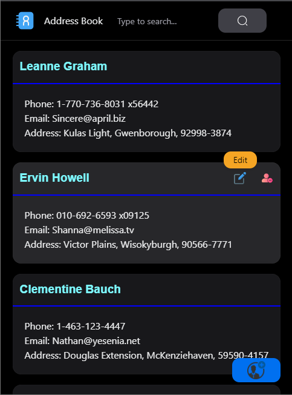

# Address Book App



## Table of Contents

- [About](#about)
- [Features](#features)
- [Getting Started](#getting-started)
- [Usage](#usage)
- [Technologies](#technologies)
- [Contributing](#contributing)
- [License](#license)

## About

The Address Book App is a simple web application that allows users to manage and organize their contacts. Users can add, edit, delete, and search for contacts.

## Features

- View a list of contacts
- Add a new contact
- Edit an existing contact
- Delete a contact
- Search for contacts by name

## Getting Started

To get started with the Address Book App, follow these steps:

1. Clone this repository:

   ```bash
   git clone https://github.com/your-username/address-book-app.git

   ```

2. Install the necessary dependencies:

  ```bash
  cd address-book-app
  npm install

3. Start the development server:

  ```bash
  npm start

4. Open the app in your browser:

```bash
  http://localhost:3000

  ## Usage

- Launch the application in your web browser.
- Use the "Add Contact" button to add new contacts.
- Click on a contact to edit or delete it.
- Use the search bar to search for contacts by name.
## Technologies
- This project is built using the following technologies:

- React
- NextUI (for UI components)
- JavaScript
- CSS
- Fetch API (for fetching data)
##Contributing
Contributions are welcome! If you'd like to contribute to the project, please follow these steps:

 - Fork the repository.
- Create a new branch for your feature or bug fix.
- Make your changes and commit them.
- Push your changes to your fork.
- Submit a pull request to the original repository.


